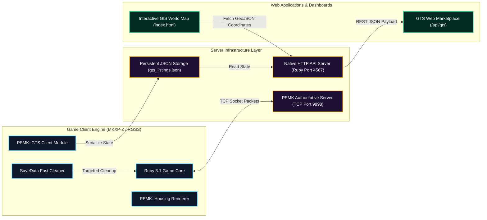
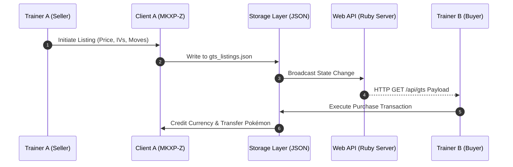

<div align="center">

  

  # Pokémon Eternal Emerald Online

  <p align="center">
    <b>Distributed MMO Architecture &bull; MKXP-Z 64-Bit Engine &bull; Pokémon Essentials v21.1 &bull; 1,026+ Species (Gen 1–9)</b>
  </p>

  <p align="center">
    
    
    
    
    
    
    
  </p>

  <p align="center">
    <a href="https://pokemonessentials.wikia.com"></a>
    <a href="https://github.com/MKXP-Z/MKXP-Z"></a>
    <a href="https://www.ruby-lang.org"></a>
    <a href="./DOCUMENTATION_COMPLETE_MODPACK.md"></a>
    
  </p>

  <p align="center">
    <a href="#overview">Overview</a> &bull;
    <a href="#architecture">Architecture</a> &bull;
    <a href="#gts-engine">GTS Engine</a> &bull;
    <a href="#housing-system">Housing System</a> &bull;
    <a href="#modpack-catalog">Modpack Catalog</a> &bull;
    <a href="#web-gis-engine">Web GIS Engine</a> &bull;
    <a href="#code-references">Code Sources</a> &bull;
    <a href="#documentation">Documentation</a> &bull;
    <a href="#installation">Getting Started</a>
  </p>

</div>

---

<a name="overview"></a>
## Overview

**Pokémon Eternal Emerald Online** est une plateforme MMO multijoueur haute performance construite sur le framework **Pokémon Essentials v21.1** et exécutée via le moteur 64-bit **MKXP-Z**. Le projet réinvente la région de Hoenn sous forme d'univers persistant en réseau, intégrant un système de transactions GTS synchrone, un moteur de housing procédural sur grille, des mécaniques de combat jusqu'à la 9e Génération et une suite logicielle web d'analyse et de cartographie GeoJSON.

---

<a name="architecture"></a>
## Distributed MMO Architecture

### System Topology & Protocol Flow



---

<a name="gts-engine"></a>
## Global Trade System (GTS Engine)

<table width="100%">
  <tr>
    <td width="18%" align="center">
      
    </td>
    <td width="82%">
      <h3>Hôtel des Ventes Multijoueur Synchrone</h3>
      <p>Le module GTS (<code>Plugins/PEMK_GTS/</code>) fournit une place de marché complète avec persistance de données :</p>
      <ul>
        <li> <b>Dépôt d'Annonces :</b> Mise en vente de Pokémon (IVs, EVs, natures, capacités) et d'objets du sac.</li>
        <li> <b>Restitution Automatique :</b> Annulation de vente avec réintégration directe dans l'équipe ou le sac du dresseur.</li>
        <li> <b>API REST Web :</b> Serveur HTTP natif (<code>server/web_server.rb</code>) exposant l'état du marché sur <code>/api/gts</code>.</li>
      </ul>
    </td>
  </tr>
</table>

### GTS Transaction Protocol Sequence



---

<a name="housing-system"></a>
## Modular Housing Engine

<table width="100%">
  <tr>
    <td width="18%" align="center">
      
    </td>
    <td width="82%">
      <h3>Système de Logement Multijoueur (PEMK Housing)</h3>
      <p>Le module Housing (<code>Plugins/PEMK_Housing/</code>) gère les parcelles privées des dresseurs sur la carte modèle (Map ID 927) :</p>
      <ul>
        <li> <b>Grille Tier 1 (11&times;7 Cases) :</b> Délimitation exacte avec origine sur <code>[0, 2]</code> et paillasson de sortie en <code>y = 9</code>.</li>
        <li> <b>Peinture de Sol Procédurale :</b> Catalogue de 10 motifs de sol applicables par sélection de zone.</li>
        <li> <b>Algorithme Z-Ordering Absolu :</b> Calcul de profondeur <code>(footprint_bottom_map_y * 32) + 16</code> empêchant le joueur de passer sous le sol ou sous les meubles.</li>
      </ul>
    </td>
  </tr>
</table>

---

<a name="modpack-catalog"></a>
## Modpack Catalog & Integrated Modules

<table width="100%">
  <thead>
    <tr>
      <th width="8%" align="center">Sprite</th>
      <th width="32%">Module / Plugin</th>
      <th width="60%">Description & Spécifications Techniques</th>
    </tr>
  </thead>
  <tbody>
    <tr>
      <td align="center"></td>
      <td><b>Following Pokémon EX</b></td>
      <td>Suivi du Pokémon tête d'équipe en temps réel sur la carte avec émotions, réactions au terrain et dialogues interactifs.</td>
    </tr>
    <tr>
      <td align="center"></td>
      <td><b>Deluxe Battle Kit & Z-Power</b></td>
      <td>Refonte complète du moteur de combat, intégration des Z-Moves, animations du Bracelet Z, Méga-Évolutions et cinématiques d'entrée.</td>
    </tr>
    <tr>
      <td align="center"></td>
      <td><b>Generation 9 Pack</b></td>
      <td>Prise en charge des 1 026 Pokémon de la Gen 1 à la Gen 9 (Paldea), y compris les attaques, talents et formes de Hisui.</td>
    </tr>
    <tr>
      <td align="center"></td>
      <td><b>Modern Quest System + UI</b></td>
      <td>Journal de quêtes interactif avec suivi des objectifs principaux/secondaires et bulles d'indications au-dessus des PNJ.</td>
    </tr>
    <tr>
      <td align="center"></td>
      <td><b>Item Crafting UI Plus & Wardrobe</b></td>
      <td>Atelier d'artisanat pour la confection d'objets/Poké Balls et garde-robe complète pour personnaliser la tenue du dresseur.</td>
    </tr>
    <tr>
      <td align="center"></td>
      <td><b>Level Caps Ex & Challenge Modes</b></td>
      <td>Plafond de niveau automatique par badge et modes de jeu avancés (Nuzlocke, Randomizer complet et Monotype).</td>
    </tr>
    <tr>
      <td align="center"></td>
      <td><b>Encounter List UI & Hyper Training</b></td>
      <td>Visualiseur des taux de rencontre sauvages par zone et système d'Entraînement Ultime avec Capsules d'Or.</td>
    </tr>
    <tr>
      <td align="center"></td>
      <td><b>Save Manager & Fast Boot</b></td>
      <td>Bouton <b>Supprimer la save</b> intégré au menu principal avec suppression ciblée ultrarafide (<b>0,001s</b>) et relance immédiate.</td>
    </tr>
  </tbody>
</table>

### Complete Registry of 47 Integrated Plugins

1. **v21.1 Hotfixes** &bull; Correctifs officiels de stabilité Essentials v21.1.
2. **[ULQ_007] Book System** &bull; Moteur de lecture de livres et documents en jeu.
3. **Generation 9 Pack** &bull; Base de données des 1 026 espèces (Gen 1–9).
4. **Modular UI Scenes** &bull; Framework UI modulaire réutilisable.
5. **[MUI] Enhanced Pokemon UI** &bull; Interface équipe et fiches Pokémon améliorées.
6. **[MUI] Improved Field Skills** &bull; Capacités hors-combat (Coupe, Vol, Surf) automatisées.
7. **[MUI] Pokedex Data Page** &bull; Visualiseur avancé des IVs, EVs et statistiques.
8. **Bag Screen w/int. Party** &bull; Sac à dos moderne avec équipe intégrée.
9. **Deluxe Battle Kit** &bull; Moteur de combat haute performance.
10. **[DBK] Animated Pokémon System** &bull; Animation des sprites Pokémon en combat.
11. **[DBK] Animated Trainer Intros** &bull; Animations d'entrée des dresseurs adverses.
12. **[DBK] Z-Power** &bull; Attaques Z et animations du Bracelet Z.
13. **[SV] Summary Screen** &bull; Écran de résumé style Écarlate & Violet.
14. **DarrylBD99's Wardrobe** &bull; Système de tenues et relookage.
15. **Video Poker** &bull; Mini-jeu de casino interactif.
16. **Secret Bases Remade** &bull; Bases Secrètes Émeraude étendues.
17. **PEMK Core** &bull; Noyau réseau multijoueur synchrone.
18. **Save File Calls** &bull; Gestionnaire d'accès aux fichiers de sauvegarde.
19. **Regicode** &bull; Énigmes et puzzles en braille des Regis.
20. **Luka's Scripting Utilities** &bull; Utilitaires graphiques et mathématiques.
21. **Permanent Repel System** &bull; Repousse automatique réutilisable.
22. **Auto Multi Save & Periodic Autosave** &bull; Sauvegarde périodique et slots multiples.
23. **PEMK Housing** &bull; Logement multijoueur et peinture de sol.
24. **PEMK GTS** &bull; Place de marché Hôtel des Ventes.
25. **PWT System (E21)** &bull; Pokémon World Tournament (Tournoi des champions).
26. **Modern Quest System + UI** &bull; Journal de quêtes interactif.
27. **Modular Title Screen** &bull; Écran titre dynamique à calques.
28. **Level Caps Ex** &bull; Caps de niveau automatiques par badge.
29. **Item Find Description** &bull; Radar et descriptions des objets cachés.
30. **Item Crafting UI Plus** &bull; Confection de Poké Balls et d'objets.
31. **Hyper Training** &bull; Entraînement Ultime des IVs au niveau 100.
32. **HGSS Dex List** &bull; Présentation Pokédex style HeartGold / SoulSilver.
33. **[DBK] SOS Battles** &bull; Système d'appels à l'aide en combat sauvage.
34. **Form Trader** &bull; PNJ de changement de formes régionales/alternatives.
35. **Following Pokemon EX** &bull; Pokémon suiveur sur la carte.
36. **Fly Animation** &bull; Animation cinématique de la capacité Vol.
37. **Event Indicators** &bull; Bulles d'indications au-dessus des PNJ.
38. **Encounter List UI** &bull; Registre des taux de rencontre par zone.
39. **Emerald UI Pack** &bull; Thème graphique Émeraude rétro-chic.
40. **Delta Speed Up** &bull; Mode d'accélération Fast-Forward.
41. **Challenge Modes** &bull; Modes Nuzlocke, Randomizer et Monotype.
42. **Caruban's Dynamic Darkness** &bull; Obscurité et éclairages dynamiques.
43. **RSE Cable Car Scene** &bull; Animation du Téléphérique du Mont Chimnée.
44. **[DBK] Enhanced Battle UI** &bull; Interface de combat étendue.
45. **Save Status HUD** &bull; Bandeau de statut de sauvegarde.
46. **BW Mystery Gift And Card Album** &bull; Cadeaux Mystère et Album de Cartes.
47. **AZERTY ZQSD Controls** &bull; Support natif des claviers AZERTY ZQSD.

---

<a name="web-gis-engine"></a>
## Web GIS & Interactive Map Engine

Le projet inclut une application web cartographique interactive (`index.html`, `app.js`, `map_data_pro.js`, `vectors.js`) permettant de visualiser l'intégralité de la région de Hoenn :

<table width="100%">
  <tr>
    <td width="18%" align="center">
      
    </td>
    <td width="82%">
      <ul>
        <li> <b>Rendu Vectoriel GeoJSON :</b> Conversion exacte des coordonnées de routes et villes de Hoenn.</li>
        <li> <b>Fiches de Rencontres par Zone :</b> Consultation dynamique des Pokémon capturables sur les 288+ routes.</li>
        <li> <b>Catalogue Multiview :</b> Recherche et filtrage en direct des 1 026 espèces de Pokémon.</li>
      </ul>
    </td>
  </tr>
</table>

---

<a name="code-references"></a>
## Code Sources & Implementation

### 1. In-Game Save Deletion Integration (`999_Patch-Load_Menu_Hard_Coded.rb`)

```ruby
# Injection du bouton 'Supprimer la save' dans la structure de menu
if show_continue
  commands[cmd_main = commands.length] = _INTL('Continuer')
  commands[cmd_delete_save = commands.length] = _INTL('Supprimer la save')
else
  commands[cmd_main = commands.length] = _INTL('Nouvelle Partie')
end

# Traitement du clic avec confirmation et lancement direct
when cmd_delete_save
  if pbConfirmMessage(_INTL("Voulez-vous vraiment supprimer votre sauvegarde et recommencer une nouvelle partie ?"))
    SaveDeletionHelper.delete_all_saves
    @scene.pbEndScene
    Game.start_new
    return
  end
```

### 2. Fast Save Directory Targeted Cleanup (0.001s)

```ruby
module SaveDeletionHelper
  def self.delete_all_saves
    SaveData.delete rescue nil if defined?(SaveData)

    user_home = ENV["USERPROFILE"] || "C:/Users/admin"
    possible_folders = [
      File.join(ENV["APPDATA"] || "", "Pokemon Eternal Emerald Complete"),
      File.join(ENV["APPDATA"] || "", "POKEMON-ONLINE"),
      File.join(user_home, "Saved Games", "Pokemon Eternal Emerald Complete")
    ]

    possible_folders.each do |folder|
      next unless File.directory?(folder)
      Dir.glob("#{folder}/*.{dat,rxdata,sav}").each { |file| File.delete(file) rescue nil }
    end
  end
end
```

---

<a name="documentation"></a>
## Documentation Index

| Fichier | Description |
| :--- | :--- |
| [`DOCUMENTATION_COMPLETE_MODPACK.md`](./DOCUMENTATION_COMPLETE_MODPACK.md) | Guide encyclopédique exhaustif des 47+ plugins, Méga-Évolutions et Housing. |
| [`POKEMON_OBTENABILITE_COMPLETE.md`](./POKEMON_OBTENABILITE_COMPLETE.md) | Rapport d'obtenabilité certifié des 1 026 espèces de Pokémon. |
| [`GUIDE_RENCONTRES_ROUTES_POKEMON.md`](./GUIDE_RENCONTRES_ROUTES_POKEMON.md) | Registre complet des tables de rencontres sauvages sur les 288+ routes de Hoenn. |
| [`POKEMON_NON_OBTENABLES.md`](./POKEMON_NON_OBTENABLES.md) | Spécifications des légendaires événementiels non capturables en état sauvage. |

---

<a name="installation"></a>
## Getting Started & Execution

### Prerequisites
- Windows 10 / 11 (64-bit)
- Ruby Runtime v3.1 (`C:\Ruby31-x64`)

### Launch Game Client
```bash
./Game.exe
```

### Launch Native HTTP API & Web Dashboard Server
```bash
ruby server/web_server.rb
```
*Web Dashboard URL:* `http://localhost:4567`

### Administration Scripts (`server/`)
```bash
ruby server/force_clear_cache.rb    # Clear compiled PluginScripts.rxdata cache
ruby server/resize_intro_images.rb  # Rescale intro graphics to native 512x384 px
ruby server/git_push.rb            # Automated Git add, commit & push to remote
```

---

<div align="center">
  
  <p><b>Pokémon Eternal Emerald MMO Architecture Engine</b></p>
</div>

