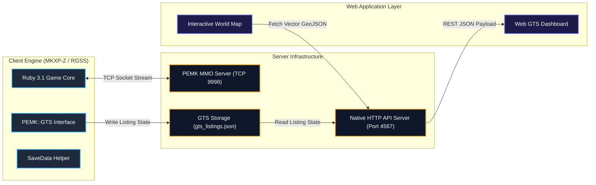
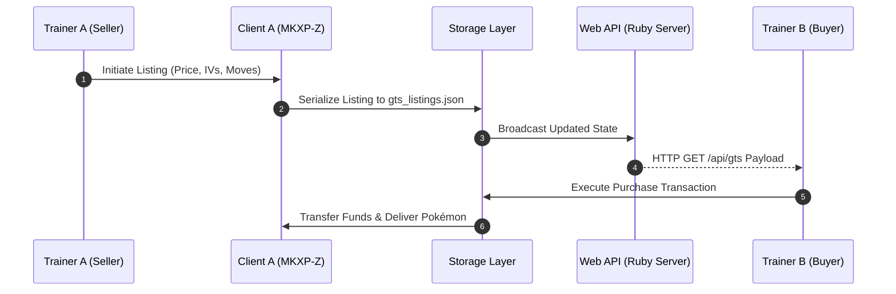

<div align="center">

  

  # Pokémon Eternal Emerald Online

  <p align="center">
    <b>Architecture MMO Persistante • Moteur MKXP-Z / Essentials v21.1 • 1 026+ Pokémon (Gen 1–9)</b>
  </p>

  <p align="center">
    <a href="https://pokemonessentials.wikia.com"></a>
    <a href="https://github.com/MKXP-Z/MKXP-Z"></a>
    <a href="https://www.ruby-lang.org"></a>
    <a href="./DOCUMENTATION_COMPLETE_MODPACK.md"></a>
    
  </p>

  <p align="center">
    <a href="#overview">Aperçu</a> &bull;
    <a href="#features">Fonctionnalités</a> &bull;
    <a href="#architecture">Architecture</a> &bull;
    <a href="#code-samples">Code Sources</a> &bull;
    <a href="#documentation">Documentation</a> &bull;
    <a href="#getting-started">Installation</a>
  </p>

</div>

---

<a name="overview"></a>
## Overview

**Pokémon Eternal Emerald Online** est une infrastructure MMO distribuée construite sur la plateforme Pokémon Essentials v21.1 et compilée via le runtime 64-bit MKXP-Z. Le projet combine un serveur multijoueur TCP autoritaire, un Hôtel des Ventes (GTS) global avec persistance de données, un système de Housing personnalisable sur grille 2D et une application web interactive temps réel.

---

<a name="features"></a>
## Key Features

<table width="100%">
  <tr>
    <td width="15%" align="center">
      
    </td>
    <td width="35%">
      <h4>Global Trade System (GTS)</h4>
      <ul>
        <li>Place de marché multijoueur synchrone.</li>
        <li>Tri dynamique par prix, IVs/EVs et capacités.</li>
        <li>Restitution automatique des listings annulés.</li>
        <li>API JSON REST native (<code>/api/gts</code>).</li>
      </ul>
    </td>
    <td width="15%" align="center">
      
    </td>
    <td width="35%">
      <h4>Modular Housing Engine</h4>
      <ul>
        <li>Gestion de parcelles privées sur grille 11&times;7.</li>
        <li>Moteur de peinture de sol procédural (10 motifs).</li>
        <li>Gestion dynamique de profondeur (Z-Ordering).</li>
        <li>Persistance JSON des données de décoration.</li>
      </ul>
    </td>
  </tr>
  <tr>
    <td width="15%" align="center">
      
    </td>
    <td width="35%">
      <h4>Save Management & Fast Boot</h4>
      <ul>
        <li>Interface de réinitialisation intégrée au menu principal.</li>
        <li>Nettoyage ciblé des sauvegardes (<strong>0,001s</strong>).</li>
        <li>Transition directe sans blocage du thread principal.</li>
        <li>Bypass automatique du cache <code>PluginScripts.rxdata</code>.</li>
      </ul>
    </td>
    <td width="15%" align="center">
      
    </td>
    <td width="35%">
      <h4>Web GIS & Multiview Engine</h4>
      <ul>
        <li>Carte du monde interactive basée sur GeoJSON.</li>
        <li>Fiches d'obtenabilité des 1 026 espèces.</li>
        <li>Base de données des rencontres sur 288+ routes.</li>
        <li>Interface web rétro-chic réactive.</li>
      </ul>
    </td>
  </tr>
</table>

---

<a name="architecture"></a>
## System Architecture

### Distributed Component Diagram



---

### GTS Transaction Protocol Sequence



---

<a name="code-samples"></a>
## Code Samples

### 1. In-Game Save Deletion Integration (`999_Patch-Load_Menu_Hard_Coded.rb`)

```ruby
# Injection du bouton 'Supprimer la save' dans la structure de menu
if show_continue
  commands[cmd_main = commands.length] = _INTL('Continuer')
  commands[cmd_delete_save = commands.length] = _INTL('Supprimer la save')
else
  commands[cmd_main = commands.length] = _INTL('Nouvelle Partie')
end

# Traitement de l'action de suppression sans blocage du thread graphique
when cmd_delete_save
  if pbConfirmMessage(_INTL("Voulez-vous vraiment supprimer votre sauvegarde et recommencer une nouvelle partie ?"))
    SaveDeletionHelper.delete_all_saves
    @scene.pbEndScene
    Game.start_new
    return
  end
```

### 2. Fast Save Directory Targeted Cleanup

```ruby
module SaveDeletionHelper
  def self.delete_all_saves
    SaveData.delete rescue nil if defined?(SaveData)

    user_home = ENV["USERPROFILE"] || "C:/Users/admin"
    target_dirs = [
      File.join(ENV["APPDATA"] || "", "Pokemon Eternal Emerald Complete"),
      File.join(ENV["APPDATA"] || "", "POKEMON-ONLINE"),
      File.join(user_home, "Saved Games", "Pokemon Eternal Emerald Complete")
    ]

    target_dirs.each do |dir|
      next unless File.directory?(dir)
      Dir.glob("#{dir}/*.{dat,rxdata,sav}").each { |f| File.delete(f) rescue nil }
    end
  end
end
```

---

<a name="documentation"></a>
## Documentation Index

| Fichier | Description |
| :--- | :--- |
| [`DOCUMENTATION_COMPLETE_MODPACK.md`](./DOCUMENTATION_COMPLETE_MODPACK.md) | Guide encyclopédique exhaustif des 47+ plugins, Méga-Évolutions et Housing. |
| [`POKEMON_OBTENABILITE_COMPLETE.md`](./POKEMON_OBTENABILITE_COMPLETE.md) | Rapport d'obtenabilité certifié des 1 026 espèces de Pokémon. |
| [`GUIDE_RENCONTRES_ROUTES_POKEMON.md`](./GUIDE_RENCONTRES_ROUTES_POKEMON.md) | Registre complet des tables de rencontres sauvages sur les 288+ routes de Hoenn. |
| [`POKEMON_NON_OBTENABLES.md`](./POKEMON_NON_OBTENABLES.md) | Spécifications des légendaires événementiels non capturables en état sauvage. |

---

<a name="getting-started"></a>
## Getting Started

### Prerequisites
- Windows 10 / 11 (64-bit)
- Ruby Runtime v3.1 (`C:\Ruby31-x64`)

### Game Execution
```bash
./Game.exe
```

### Start Native HTTP Web Server
```bash
ruby server/web_server.rb
```
*Access Web Dashboard:* `http://localhost:4567`

### Administration Scripts
```bash
ruby server/force_clear_cache.rb    # Clear compiled PluginScripts.rxdata cache
ruby server/resize_intro_images.rb  # Rescale intro graphics to native 512x384 px
ruby server/git_push.rb            # Execute automated Git commit & push
```

---

<div align="center">
  
  <p><b>Pokémon Eternal Emerald MMO Engine</b></p>
</div>

