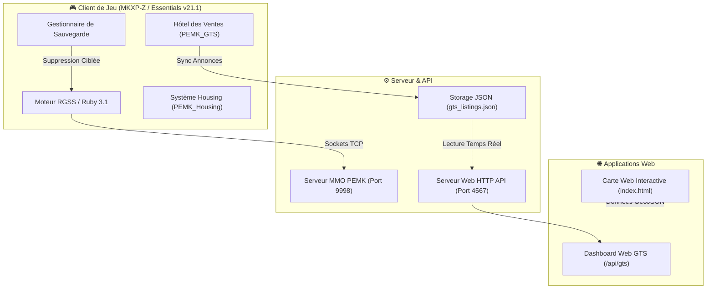
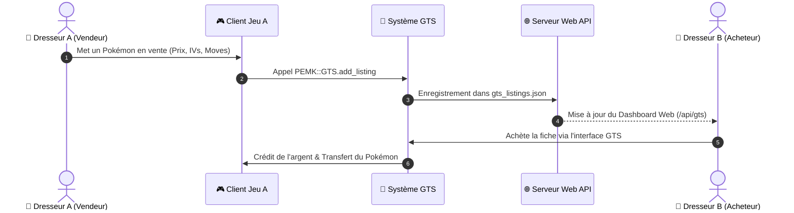

<div align="center">

# 🌋 Pokémon Eternal Emerald Online

<p align="center">
  <b>Le Modpack & MMO Ultime — 1 026+ Pokémon • Multijoueur Synchrone • GTS & Housing Temps Réel</b>
</p>

[](https://pokemonessentials.wikia.com)
[](https://github.com/MKXP-Z/MKXP-Z)
[](https://www.ruby-lang.org)
[](./DOCUMENTATION_COMPLETE_MODPACK.md)
[](#)

---

<p align="center">
  <a href="#-aperçu-du-projet">Aperçu</a> •
  <a href="#-fonctionnalités-phares">Fonctionnalités</a> •
  <a href="#-architecture--diagrammes">Architecture</a> •
  <a href="#-encyclopédie--guides">Encyclopédie</a> •
  <a href="#-installation--démarrage">Installation</a>
</p>

</div>

---

## 📖 1. Aperçu du Projet

**Pokémon Eternal Emerald Online** est la version ultime et multijoueur du légendaire Pokémon Émeraude. Propulsé par **Pokémon Essentials v21.1** et le moteur haute performance **MKXP-Z**, le jeu réinvente Hoenn en y intégrant un univers MMO persistant, des mécaniques modernes jusqu'à la Génération 9, et un écosystème web complet.

---

## ⭐ 2. Fonctionnalités Phares

### 🏪 Hôtel des Ventes (GTS - Global Trade System)
* **Marché multijoueur en temps réel** : Déposez vos Pokémon (avec leurs IVs, EVs, natures et capacités) ou vos objets du sac.
* **Interface Vendeur / Acheteur** : Filtrage par catégorie, recherche textuelle, tri par prix, annulations immédiates avec restitution dans le sac/équipe.
* **Sync Web & API Live** : Annonces synchronisées en direct sur le web via `server/web_server.rb` (`/api/gts`).

### 🏡 Système de Housing Multijoueur (PEMK Housing)
* **Propriétés personnalisables** : Achetez et décorez votre propre maison sur la grille Tier 1 (11×7 cases).
* **Peinture de sol procédurale** : Choisissez parmi 10 motifs de sol procéduraux avec mode d'application par zone.
* **Rendu Z-Ordering parfait** : Système de profondeur dynamique garantissant que le dresseur se déplace au-dessus du sol et des meubles solides.

### 🗑️ Gestionnaire de Sauvegarde Intégré
* **Effacement & Nouvelle Partie** : Bouton **`Supprimer la save`** directement accessible sur l'écran d'accueil du jeu.
* **Nettoyage Ultrarafide (0,001s)** : Ciblage optimisé des répertoires de sauvegarde sans blocage ni écran noir.

### 🗺️ Carte Web Interactive & Web App Multiview
* **Carte Interactive du Monde** : Application web (`index.html`, `app.js`, `map_data_pro.js`) affichant l'ensemble de Hoenn avec les rencontres par route.
* **Guide d'Obtenabilité** : Base de données dynamique répertoriant la totalité des 1 026 Pokémon.

---

## 🏗️ 3. Architecture & Diagrammes Système

### 📐 Vue d'Ensemble de l'Infrastructure



---

### 🔄 Flux d'Achat / Vente GTS



---

## 💻 4. Extraits de Code Signatures

### 🟢 1. Intégration du Bouton "Supprimer la save" ([`999_Patch-Load_Menu_Hard_Coded.rb`](file:///c:/Users/admin/Documents/Pokemon-MMO-Eternal-Emerald/Plugins/BW%20Mystery%20Gift/999_Patch-Load_Menu_Hard_Coded.rb#L65-L105))

```ruby
# Injection du bouton dans le menu principal
if show_continue
  commands[cmd_main = commands.length] = _INTL('Continuer')
  commands[cmd_delete_save = commands.length] = _INTL('Supprimer la save')
else
  commands[cmd_main = commands.length] = _INTL('Nouvelle Partie')
end

# Gestion du clic avec confirmation et lancement direct
when cmd_delete_save
  if pbConfirmMessage(_INTL("Voulez-vous vraiment supprimer votre sauvegarde et recommencer une nouvelle partie ?"))
    SaveDeletionHelper.delete_all_saves
    @scene.pbEndScene
    Game.start_new
    return
  end
```

---

### 🟢 2. Helper de Suppression Instantanée Ciblée

```ruby
module SaveDeletionHelper
  def self.delete_all_saves
    SaveData.delete rescue nil if defined?(SaveData)

    user_home = ENV["USERPROFILE"] || "C:/Users/admin"
    possible_folders = [
      File.join(ENV["APPDATA"] || "", "Pokemon Eternal Emerald Complete"),
      File.join(ENV["APPDATA"] || "", "POKEMON-ONLINE"),
      File.join(user_home, "Saved Games", "Pokemon Eternal Emerald Complete")
    ]

    possible_folders.each do |folder|
      next unless File.directory?(folder)
      Dir.glob("#{folder}/*.{dat,rxdata,sav}").each { |file| File.delete(file) rescue nil }
    end
  end
end
```

---

## 📚 5. Encyclopédie & Documentation de Référence

Le projet comprend une suite complète de documentations encyclopédiques :

| Document | Description |
| :--- | :--- |
| **[`DOCUMENTATION_COMPLETE_MODPACK.md`](./DOCUMENTATION_COMPLETE_MODPACK.md)** | Encyclopédie maîtresse des 47+ mods, Méga-Évolutions, Housing et quêtes. |
| **[`POKEMON_OBTENABILITE_COMPLETE.md`](./POKEMON_OBTENABILITE_COMPLETE.md)** | Audit d'obtenabilité des 1 026 Pokémon (Gen 1 à Gen 9). |
| **[`GUIDE_RENCONTRES_ROUTES_POKEMON.md`](./GUIDE_RENCONTRES_ROUTES_POKEMON.md)** | Guide officiel des taux et lieux de rencontre sur les 288+ routes de Hoenn. |
| **[`POKEMON_NON_OBTENABLES.md`](./POKEMON_NON_OBTENABLES.md)** | Liste exacte des espèces réservées aux événements. |

---

## 📁 6. Structure du Dépôt

```
Pokemon-MMO-Eternal-Emerald/
├── 📂 Audio/                  # Musiques (BGM), Effets sonores (SE) et vidéos
├── 📂 Data/                   # Bases de données du jeu (.rxdata)
├── 📂 Graphics/               # Sprites, Décors, Tilesets & Images UI (512x384)
│   ├── 📂 Pictures/           # Visuels d'intro (introbg.png, introbg_1.png)
│   └── 📂 Titles/             # Fonds d'écran titre (splash.png, logo.png)
├── 📂 Plugins/                # Modpack & Extensions Ruby (47+ Plugins)
│   ├── 📂 PEMK_GTS/           # Système GTS Hôtel des Ventes
│   ├── 📂 PEMK_Housing/       # Système de Housing Multijoueur
│   └── 📂 BW Mystery Gift/    # Menu d'accueil & Patch 999_
├── 📂 server/                 # Scripts d'administration & Serveur Web API
│   ├── 📄 web_server.rb       # Serveur HTTP Dashboard (Port 4567)
│   ├── 📄 force_clear_cache.rb# Vissage du cache PluginScripts.rxdata
│   ├── 📄 resize_intro_images.rb # Utility de redimensionnement 512x384
│   └── 📄 git_push.rb         # Utility d'exportation Git
├── 📄 index.html              # Carte Web Interactive & Multiview App
├── 📄 app.js                  # Logique frontend de la Carte Web
└── 📄 Game.exe                # Exécutable principal du jeu (MKXP-Z)
```

---

## 🚀 7. Installation & Démarrage

### 1️⃣ Lancer le Jeu
Double-cliquez sur `Game.exe` ou exécutez dans votre console :
```bash
./Game.exe
```

### 2️⃣ Lancer le Serveur Web Dashboard (API GTS & Temps Réel)
Dans une console PowerShell :
```bash
ruby server/web_server.rb
```
Accédez au dashboard sur : **`http://localhost:4567`**

### 3️⃣ Commandes Utiles (Scripts Administration `server/`)
```bash
ruby server/force_clear_cache.rb    # Réinitialise le cache des plugins (.rxdata)
ruby server/resize_intro_images.rb  # Redimensionne les images d'intro en 512x384 px
ruby server/git_push.rb            # Publie automatiquement toutes les modifs sur GitHub
```

---

<div align="center">
  <p><b>Pokémon Eternal Emerald MMO</b> — <i>Projet communautaire développé avec passion.</i></p>
</div>

