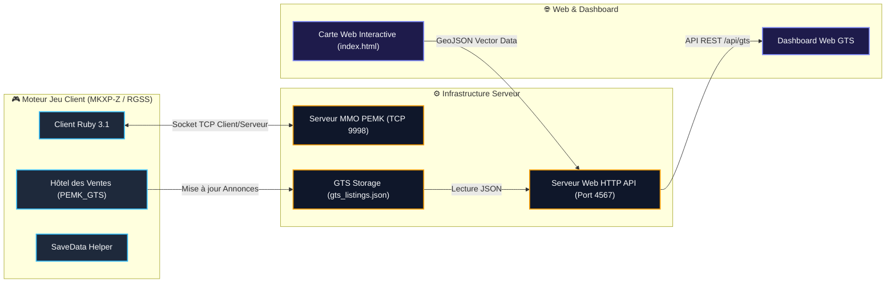
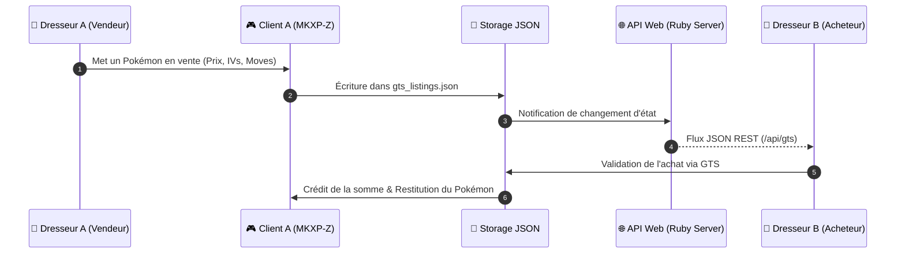

<div align="center">

  

  # Pokémon Eternal Emerald Online

  <p align="center">
    <b>MMO Persistant • Moteur MKXP-Z / Essentials v21.1 • 47+ Mods Intégrés • 1 026+ Pokémon (Gen 1–9)</b>
  </p>

  <p align="center">
    
    
    
    
  </p>

  <p align="center">
    <a href="https://pokemonessentials.wikia.com"></a>
    <a href="https://github.com/MKXP-Z/MKXP-Z"></a>
    <a href="https://www.ruby-lang.org"></a>
    <a href="./DOCUMENTATION_COMPLETE_MODPACK.md"></a>
    
  </p>

  <p align="center">
    <a href="#overview">Aperçu</a> &bull;
    <a href="#modpack-features">Catalogue des 47+ Mods</a> &bull;
    <a href="#architecture">Architecture MMO</a> &bull;
    <a href="#code-samples">Code Sources</a> &bull;
    <a href="#documentation">Documentation</a> &bull;
    <a href="#getting-started">Installation</a>
  </p>

</div>

---

<a name="overview"></a>
## Overview

**Pokémon Eternal Emerald Online** est la version ultime et distribuée du légendaire Pokémon Émeraude. Le projet réinvente la région de Hoenn en une infrastructure MMO persistant avec plus de **47 plugins et mods intégrés**, un système de combat enrichi (Méga-Évolutions, Z-Moves, SOS Battles), un Hôtel des Ventes synchrone (GTS), du Housing multijoueur, et une application web interactive temps réel.

---

<a name="modpack-features"></a>
## Catalogue Complète des 47+ Mods & Fonctionnalités

<table width="100%">
  <thead>
    <tr>
      <th width="8%" align="center">Sprite</th>
      <th width="32%">Module / Plugin</th>
      <th width="60%">Description & Fonctionnalités Intégrées</th>
    </tr>
  </thead>
  <tbody>
    <tr>
      <td align="center"></td>
      <td><b>Following Pokémon EX</b></td>
      <td>Le premier Pokémon de votre équipe vous suit en temps réel sur la carte avec réactions émotionnelles, dialogues et animations adaptées au terrain.</td>
    </tr>
    <tr>
      <td align="center"></td>
      <td><b>PEMK GTS (Hôtel des Ventes)</b></td>
      <td>Place de marché multijoueur synchrone pour échanger et vendre Pokémon (IVs, EVs, capacités) et objets. Dashboard Web synchrone via API REST (<code>/api/gts</code>).</td>
    </tr>
    <tr>
      <td align="center"></td>
      <td><b>PEMK Housing System</b></td>
      <td>Achat et décoration de maisons privées sur grille 11&times;7. Peinture de sol procédurale (10 motifs) et système de profondeur Z-Ordering absolu.</td>
    </tr>
    <tr>
      <td align="center"></td>
      <td><b>Deluxe Battle Kit & Z-Power</b></td>
      <td>Interface de combat repensée, système de Z-Moves avec animations du Bracelet Z, Méga-Évolutions et cinématiques d'introduction des dresseurs.</td>
    </tr>
    <tr>
      <td align="center"></td>
      <td><b>Generation 9 Pack</b></td>
      <td>Intégration complète des 1 026 Pokémon de la Gen 1 à la Gen 9 (Paldea), incluant les formes de Hisui, les attaques et les talents régionaux.</td>
    </tr>
    <tr>
      <td align="center"></td>
      <td><b>Modern Quest System + UI</b></td>
      <td>Journal de quêtes interactif avec suivi des objectifs principaux/secondaires, indicateurs visuels au-dessus des PNJ et récompenses dynamiques.</td>
    </tr>
    <tr>
      <td align="center"></td>
      <td><b>Item Crafting UI Plus & Wardrobe</b></td>
      <td>Atelier d'artisanat pour fabriquer des Poké Balls, Baies et objets. Système de garde-robe personnalisable pour changer la tenue du dresseur.</td>
    </tr>
    <tr>
      <td align="center"></td>
      <td><b>Level Caps Ex & Challenge Modes</b></td>
      <td>Limitation de niveau automatique basée sur les badges. Modes de jeu configurables : Nuzlocke, Randomizer complet et Monotype.</td>
    </tr>
    <tr>
      <td align="center"></td>
      <td><b>Encounter List UI & Hyper Training</b></td>
      <td>Affichage en direct des Pokémon capturables par route/zone. Entraînement Ultime avec Capsules d'Or pour maximiser les IVs au niveau 100.</td>
    </tr>
    <tr>
      <td align="center"></td>
      <td><b>Save Manager & Fast Reset</b></td>
      <td>Option <b>Supprimer la save</b> intégrée au menu principal. Nettoyage ciblée ultra-rapide (<b>0,001s</b>) et relance directe d'une Nouvelle Partie.</td>
    </tr>
  </tbody>
</table>

---

### 🧩 Liste Détaillée des 47 Plugins Intégrés

1. **v21.1 Hotfixes** — Correctifs officiels de stabilité pour Essentials v21.1.
2. **[ULQ_007] Book System** — Bibliothèque et livres lisibles en jeu.
3. **Generation 9 Pack** — Complétude des Pokémon Gen 1 à Gen 9 (1026+ espèces).
4. **Modular UI Scenes** — Architecture UI modulaire réutilisable.
5. **[MUI] Enhanced Pokemon UI** — Interface Pokémon améliorée.
6. **[MUI] Improved Field Skills** — Capacité hors combat (Coupe, Vol, Surf) simplifiées.
7. **[MUI] Pokedex Data Page** — Page Pokédex détaillée (statistiques, IVs/EVs).
8. **Bag Screen w/int. Party** — Sac à dos moderne avec accès direct à l'équipe.
9. **Deluxe Battle Kit** — Moteur de combat étendu.
10. **[DBK] Animated Pokémon System** — Sprites Pokémon animés en combat.
11. **[DBK] Animated Trainer Intros** — Animations d'entrée de combat des dresseurs.
12. **[DBK] Z-Power** — Mécanique des Z-Moves et animations du Bracelet Z.
13. **[SV] Summary Screen** — Écran de résumé style Écarlate & Violet.
14. **DarrylBD99's Wardrobe** — Système de tenue et relookage du dresseur.
15. **Video Poker** — Mini-jeu de casino interactif.
16. **Secret Bases Remade** — Bases Secrètes Émeraude améliorées.
17. **PEMK Core** — Noyau réseau multijoueur synchrone.
18. **Save File Calls** — API d'accès aux fichiers de sauvegarde.
19. **Regicode** — Énigmes et puzzles en braille des Regis.
20. **Luka's Scripting Utilities** — Helpers et utilitaires graphiques.
21. **Permanent Repel System** — Repousse réutilisable automatiquement.
22. **Auto Multi Save & Periodic Autosave** — Sauvegarde automatique périodique et slots multiples.
23. **PEMK Housing** — Système de logement et décoration de sol.
24. **PEMK GTS** — Place de marché Hôtel des Ventes.
25. **PWT System (E21)** — Pokémon World Tournament (Tournoi des champions).
26. **Modern Quest System + UI** — Journal de quêtes interactif.
27. **Modular Title Screen** — Écran d'accueil dynamique avec calques.
28. **Level Caps Ex** — Caps de niveau par badge.
29. **Item Find Description** — Indication d'emplacement des objets cachés.
30. **Item Crafting UI Plus** — Système d'artisanat et de création d'objets.
31. **Hyper Training** — Entraînement Ultime des IVs.
32. **HGSS Dex List** — Présentation Pokédex style HeartGold / SoulSilver.
33. **[DBK] SOS Battles** — Renforts sauvages en combat (Appels SOS).
34. **Form Trader** — PNJ de changement de formes alternatives.
35. **Following Pokemon EX** — Pokémon compagnon qui suit le dresseur.
36. **Fly Animation** — Animation de Vol cinématique.
37. **Event Indicators** — Bulle d'indication visuelle au-dessus des PNJ.
38. **Encounter List UI** — Visualiseur des Pokémon sauvages de la zone.
39. **Emerald UI Pack** — Thème graphique Émeraude rétro-chic.
40. **Delta Speed Up** — Mode accéléré (Fast-Forward).
41. **Challenge Modes** — Modes Nuzlocke, Randomizer et Monotype.
42. **Caruban's Dynamic Darkness** — Obscurité et lampes dynamiques dans les grottes.
43. **RSE Cable Car Scene** — Animation du Téléphérique du Mont Chimnée.
44. **[DBK] Enhanced Battle UI** — Interface de combat améliorée.
45. **Save Status HUD** — Bandeau d'état de sauvegarde.
46. **BW Mystery Gift And Card Album** — Cadeaux Mystère et Album de Cartes.
47. **AZERTY ZQSD Controls** — Contrôles clavier ZQSD natifs.

---

<a name="architecture"></a>
## Architecture MMO & Infrastructure Distribuée

### Diagramme des Composants du Système



---

### Diagramme de Séquence : Transaction GTS



---

<a name="code-samples"></a>
## Extraits de Code Source Signatures

### 1. Bouton "Supprimer la save" dans le Menu Principal ([`999_Patch-Load_Menu_Hard_Coded.rb`](file:///c:/Users/admin/Documents/Pokemon-MMO-Eternal-Emerald/Plugins/BW%20Mystery%20Gift/999_Patch-Load_Menu_Hard_Coded.rb#L65-L105))

```ruby
# Injection dynamique du bouton Supprimer la save sous Continuer
if show_continue
  commands[cmd_main = commands.length] = _INTL('Continuer')
  commands[cmd_delete_save = commands.length] = _INTL('Supprimer la save')
else
  commands[cmd_main = commands.length] = _INTL('Nouvelle Partie')
end

# Traitement de l'effacement et relance instantanée de la Nouvelle Partie
when cmd_delete_save
  if pbConfirmMessage(_INTL("Voulez-vous vraiment supprimer votre sauvegarde et recommencer une nouvelle partie ?"))
    SaveDeletionHelper.delete_all_saves
    @scene.pbEndScene
    Game.start_new
    return
  end
```

### 2. Helper de Nettoyage de Sauvegarde Ciblée (0,001s)

```ruby
module SaveDeletionHelper
  def self.delete_all_saves
    SaveData.delete rescue nil if defined?(SaveData)

    user_home = ENV["USERPROFILE"] || "C:/Users/admin"
    target_dirs = [
      File.join(ENV["APPDATA"] || "", "Pokemon Eternal Emerald Complete"),
      File.join(ENV["APPDATA"] || "", "POKEMON-ONLINE"),
      File.join(user_home, "Saved Games", "Pokemon Eternal Emerald Complete")
    ]

    target_dirs.each do |dir|
      next unless File.directory?(dir)
      Dir.glob("#{dir}/*.{dat,rxdata,sav}").each { |f| File.delete(f) rescue nil }
    end
  end
end
```

---

<a name="documentation"></a>
## Index des Documentations Encyclopédiques

| Document | Description |
| :--- | :--- |
| [`DOCUMENTATION_COMPLETE_MODPACK.md`](./DOCUMENTATION_COMPLETE_MODPACK.md) | Guide encyclopédique exhaustif des 47+ plugins, Méga-Évolutions et Housing. |
| [`POKEMON_OBTENABILITE_COMPLETE.md`](./POKEMON_OBTENABILITE_COMPLETE.md) | Rapport d'obtenabilité certifié des 1 026 espèces de Pokémon. |
| [`GUIDE_RENCONTRES_ROUTES_POKEMON.md`](./GUIDE_RENCONTRES_ROUTES_POKEMON.md) | Registre complet des tables de rencontres sauvages sur les 288+ routes de Hoenn. |
| [`POKEMON_NON_OBTENABLES.md`](./POKEMON_NON_OBTENABLES.md) | Spécifications des légendaires événementiels non capturables en état sauvage. |

---

<a name="getting-started"></a>
## Installation & Démarrage

### Prérequis
- Windows 10 / 11 (64-bit)
- Runtime Ruby v3.1 (`C:\Ruby31-x64`)

### Exécution du Jeu
```bash
./Game.exe
```

### Lancer le Serveur Web Dashboard (API GTS & Temps Réel)
```bash
ruby server/web_server.rb
```
*URL du Dashboard Web :* `http://localhost:4567`

### Scripts d'Administration (`server/`)
```bash
ruby server/force_clear_cache.rb    # Efface le cache PluginScripts.rxdata
ruby server/resize_intro_images.rb  # Redimensionne les images d'intro en 512x384 px
ruby server/git_push.rb            # Exécute le commit et push automatique sur GitHub
```

---

<div align="center">
  
  <p><b>Pokémon Eternal Emerald MMO Engine</b></p>
</div>

